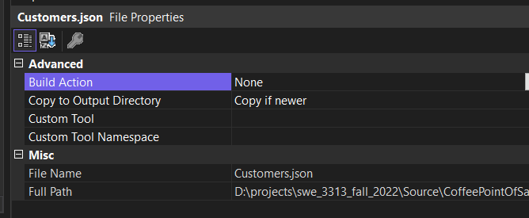

# Base Project Usage

## Fork this project

Each team needs to fork this project.

Every project submission will be checked into your forked repo, including documentation, code, etc.

Get used to cloning, merging, and pushing changes. Here's a good getting started video: https://www.youtube.com/watch?v=mVnZVw4KJnc

To understand forking, take a look at this: https://docs.github.com/en/get-started/quickstart/fork-a-repo

IMPORTANT: Each team will have a Github repo that the team will share. Anytime you submit your work, you will put the repo's link
in the D2L assignment submission. I will not accept zip files or other documents via D2L. You must submit your work via Github.

## How to Add a Form

1. Your FormMain is already configured, aside from adding whatever graphics, logic, navigation, etc. the requirements demand.
1. The FormManagement class demonstrates how to configure the other forms in your project:
    1. Inherit from BaseFormNoClose. This will ensure your form is automatically registered with the Dependency Injection container.
    1. To close a form, call the Close() method.
    1. To return to FormMain, call FormFactory.Get<FormMain>().Show(); after closing.
    1. In every form, be sure to override OnLoad with a call to base.OnLoad:
        ```
        protected override void OnLoad(object sender, EventArgs e)
        {
            base.OnLoad(sender, e); //if we override OnLoad, we still need to call the base OnLoad method to setup the form in a standard fashion
            //your code...
        }
        ```
1. To test your new form, add a button to another form and open the new form like this:
   ```FormFactory.Get<NewFormClassNameHere>().ShowDialog();```

   If this call fails, then your new form does not inhert from BaseFormNoClose.

## Registering services

The base project uses the Microsoft dependency injection (DI) framework to help you decouple your code using the Inversion of Control (IoC) pattern.

The ```Startup``` class contains the registration methods you need when you need a new service available to the DI container.

If you need to create additional services, register them in ```Startup.ConfigureDependencies```:

```
private static void ConfigureDependencies(IServiceCollection services)
    {
        services.AddSingleton<IStorageService, StorageService>();
        services.AddSingleton<ICustomerService, CustomerService>();
        services.AddSingleton<IMenuService, MenuService>();

        //add your dependencies here

        RegisterForms(services);
        services.AddLogging(configure => configure.AddConsole());
    }
 ```

## Configuration

The base project already has a JSON configuration file called appsettings.json. You will note that the structure of this file
matches the classes in the ```Configuration``` namespace. ```Configuration.AppSettings``` is the root of the configuration class structure.

To add additional configuration properties, add them to ```Configuration.AppSettings``` and the actual configuration to appsettings.json.

## Dependencies

The base project already references the ```Newtonsoft.Json``` Nuget package. There are many JSON parsers available in the .NET ecosystem.
I choose Newtonsoft for this project because it is popular, friendly, flexible, and well documented. In practice, Newtonsoft is being replaced
by Microsoft's faster ```System.Test.Json``` parser, but I avoided it because it is a bit more complex in certain cases.

The ```StorageService``` already is wired up and uses the JSON parser, so you won't need to worry top much about implementing the JSON read/write
requirement.

You also need to reference these Nuget packages:

*  CsvHelper - https://joshclose.github.io/CsvHelper/
*  CreditCardValidator - https://github.com/gustavofrizzo/CreditCardValidator

## Storage

The ```StorageService``` reads and writes JSON files from/to the `bin\Debug\net6.0\JsonStorage` directory.

When you compile your application, it copies everything in the application's ```JsonStorage``` directory to the ```bin``` directory. Your
Menu.json file will go in the application's ```JsonStorage``` directory where it will be copied into the ```bin``` directory for your
application to load on start.

To create your ```DrinkMenuService```, review how the ```CustomerService``` is implemented. It will follow the same pattern.

When you add your Menu.json file to ```JsonStorage```, be sure to set its ```Copy to Output Directory``` property to ```Copy if newer```.
If you omit this step, the compiler will not copy the JSON file to the ```bin``` directory.



## Numeric Data

You will note in the ```AppSettings.Tax``` class that the tax rate is stored as a decimal data type.

The decimal type is used for financial data (or any data where floating point precision is critical). You will store
all data related to financial transactions using decimal. Do not use double or float for financial data.

For more information, read these links:
https://stackoverflow.com/questions/803225/when-should-i-use-double-instead-of-decimal
https://exceptionnotfound.net/decimal-vs-double-and-other-tips-about-number-types-in-net/


